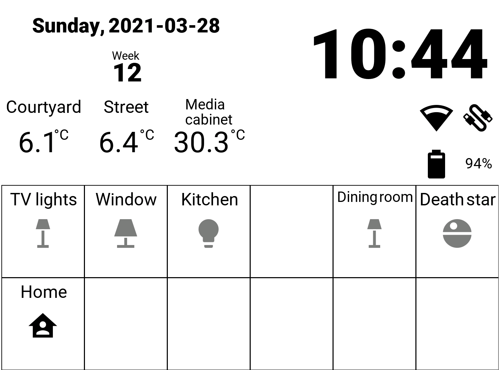

# HAslate - E-ink Home Assistant Dashboard

This is a Python/pygame application that provides a simple home
automation dashboard that works with [Home Assistant]. It's made
to work on limited Linux platforms with e-ink displays, such as
e-readers.

### Why?

The standard Home Assistant UI requires a pretty full-featured web
browser and the [Kobo Clara HD]s that I wanted to use have a web
browser that doesn't work with it.

For a while I used [HADashboard] but I couldn't configure it how I
liked it and couldn't persuade the Kobo browser to show it full
screen.

I also wanted to play around with building my own [Yocto]-based Linux
distribution, to get a newer kernel and userspace running on the Kobos.

## Installation

For developing on a desktop computer you'll need recent Python (>=3.8)
and the packages in requirements.txt.

To run on a device you'll need it to be running a Linux system with all
the appropriate dependencies. I made a Yocto layer that will
produce a working system with HAslate installed. You can find it at
[meta-kobo-clara-hd].

## Usage

For development you can run the application in a window with
`haslate --window`. The editable configuration directory is /tmp/haslate/config/haslate.yaml.

On device the application will run automatically at startup. The Yocto
system installs it in /home/koboapp/haslate. The editable configuration
is on an externally-accessible partition on the device's SD card, mounted
at /media/data/config/haslate.yaml.

Pressing the power button on the device will exit HAslate, by default
the system is configured to restart it immediately.

## Configuration

When the application starts it tries to find the editable configuration
file. If there isn't one then it copies the last configuration to the
editable configuration file. If there isn't any configuration then it
copies a configuration template to the editable configuration file and
asks the user to edit the configuration.

Configuration is in YAML format, the template has comments describing
the contents.

The user can edit the editable configuration file by plugging the device
into a computer, the new configuration will be applied when the device
is unplugged.

## Contributing

Pull requests are welcome. For major changes please open an issue first
to discuss what you want to change.

## To do

The application is currently in a state where it has the minimal
functions I need.

- [ ] Implement multiple pages.
- [ ] Use proper logging instead of `print` (although the application is run from systemd so output ends up in a logfile)
- [ ] Improve error handling
- [ ] Improve text layout
- [ ] Make HAslate less hardware-specific
- [ ] Allow backlight control (it's currently always on)

## License

[MIT](https://spdx.org/licenses/MIT.html)

[Home Assistant]: https://www.home-assistant.io
[Kobo Clara HD]: https://us.kobobooks.com/products/kobo-clara-hd
[HADashboard]: https://appdaemon.readthedocs.io/en/latest/DASHBOARD_CREATION.html
[Yocto]: https://www.yoctoproject.org
[meta-kobo-clara-hd]: https://github.com/kevinior/meta-kobo-clara-hd